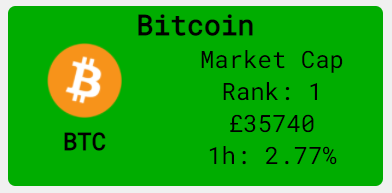
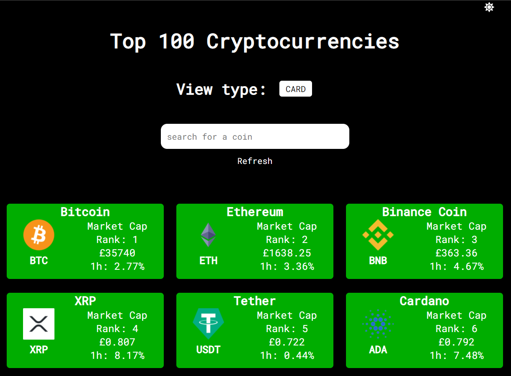
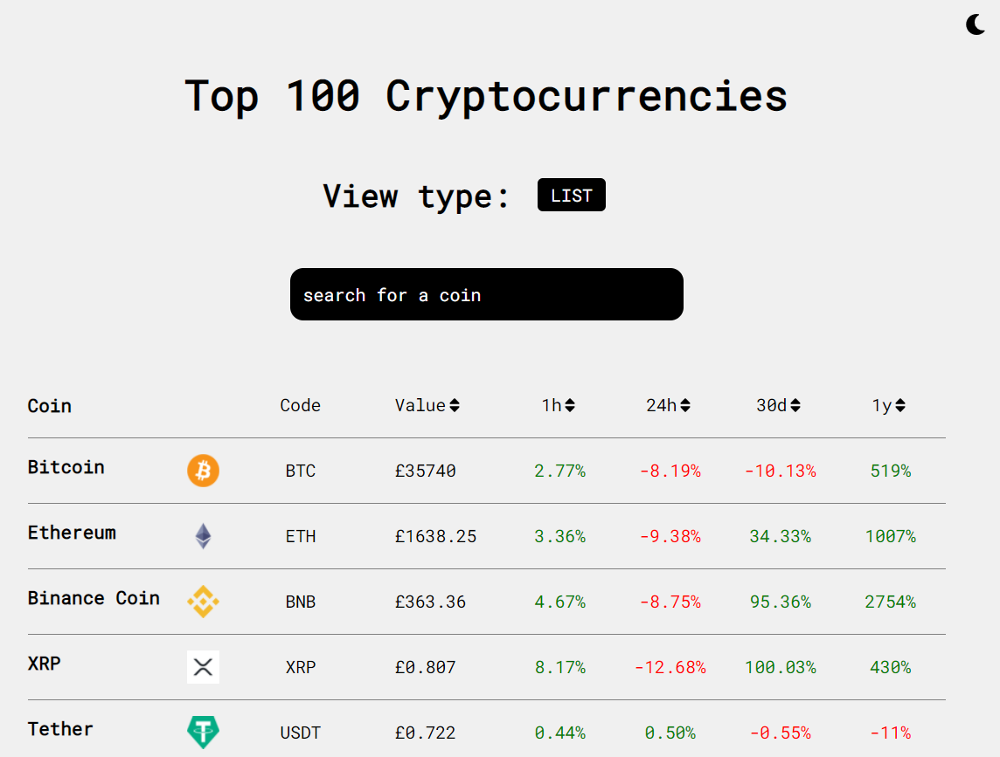

<!-- PROJECT LOGO -->

 

  

  <h3 align="center">Cryptocurrency Dashboard</h3>

  

    Top 100 cryptocurrencies displayed in list and card format using React.js
     
     
    <a href="https://top100cryptocurrencies.netlify.app/" target='#'>View Demo</a>
    ·
    <a href="https://github.com/samatarx/Crypto-Dashboard/issues">Report Bug</a>
    ·
    <a href="https://github.com/samatarx/Crypto-Dashboard/issues">Request Feature</a>
  

<!-- TABLE OF CONTENTS -->

## Table of Contents

1. [About the Project](#about-the-project)
2. [Built With](#built-with)
3. [Features](#features)
4. [React](#react)
5. [SEO](#seo)
6. [Future Work](#future-work)
7. [Contact](#contact)
8. [Acknowledgements](#acknowledgements)

<!-- ABOUT THE PROJECT -->

## About The Project

Cryptocurrencies and decentralised finance (DeFi) are taking over the world and redefining what money is. I wanted to create a dashboard which displays the current price of a coin and more importantly the price changes of the coin.

I used the JAMstack approach to build this project, I found an amazing free API from Coingecko and I leveraged my React.js skills to build an elegant dashboard.

### Built With

- [React JS](https://reactjs.org/)
- [Font Awesome](https://fontawesome.com/)
- [Google Fonts](https://fonts.google.com/)
- [React Loader](https://github.com/mhnpd/react-loader-spinner)
- HTML/CSS/JS

<!-- USAGE EXAMPLES -->

## Features

- Displays cryptocurrency information/data about current values and price changes from 1 day to 1 year
- Users can search through the data using the input bar
- Data can be viewed in list format and in card format
- Created a button to allow users to return to the top of the page effortlessly
- Implemented a Light and Dark mode setting
- Made a CSS animation informing users to rotate the screen
- Web app is responsive to all screen sizes

- Card view in Dark Mode

- List View in Light Mode
<!-- React -->

## React

- Implemented the use of React hooks through the project
- Used useEffect to call the data in an asynchronous way
- Allow users to switch between card and list view using useState properties and terniary operators
- Used .map(), .filter(), .sort() and .includes() to manipulate the JSON file recieved from the API

<!-- SEO -->

## SEO

Recieved an average score of 99.5 across all Google Lighthouse metrics

<!-- Future Improvements -->

## Future work

- Display tickers/price graphs using Chart.js or equivalent
- Allow users to compare
- Make the mobile rotate optional
- Create tests for the project

<!-- CONTACT -->

## Contact

Samatar Xasan - [@samatarcodes](https://twitter.com/samatarcodes) - email

Project Link: [https://github.com/samatarx/crypto-dashboard](https://github.com/samatarx/Crypto-Dashboard)

<!-- ACKNOWLEDGEMENTS -->

## Acknowledgements

- [coingecko.com](https://www.coingecko.com/en)
